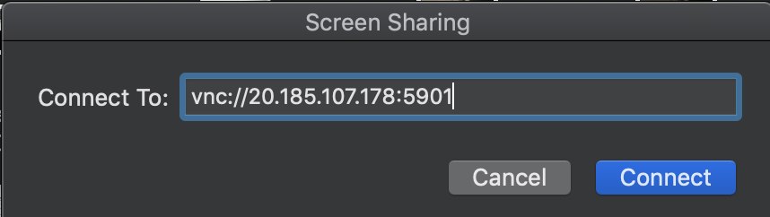

# Running an Android Emulator in Azure Container Instances

Evolved from the article at: https://medium.com/@AndreSand/android-emulator-on-docker-container-f20c49b129ef

## Usage

### Building the Container
Build the Docker container to include your public key, assuming you have a private key / public keypair with the default name id_rsa in ~/.ssh.

*Note:* Copying your public key into the image is not a production solution, unless you have means to expire and rotate your keys. 

```bash
$ cd aci

# copy your public key 
$ cp ~/.ssh/id_rsa.pub ./sshlocal
$ docker build -t <your repo>/android-emu:<tag> .
$ docker push xtoph/android-emu:<tag>
```

### Deploye the container to ACI
- Edit `android-emu-aci.yaml` with your container image
- Run `deploy.sh`

At the end of this step you will have the container running in Azure Container instances.

### Connect to the container

Get the IP address for your running container, e.g. with the Azure CLI:

```bash
$ az container show -g aci-rg -n sdkfiles --query ipAddress.ip
"20.185.107.178"
```

VNC to the container's IP adress port 5901 with your favorite VNC client


## Known Issues
- Emulator displays on wrong display
- Only ARM emulators are supprted. x86 emulators require nested virtualization, which Azure Container Instances doesn't support. 
- SSH port is open for debugging purposes.